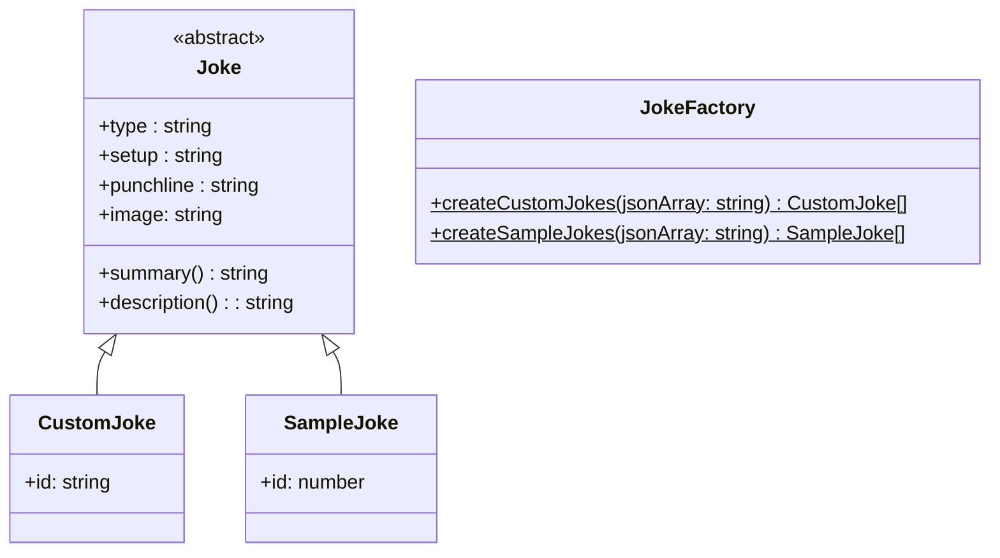

# Énoncé semaine 1

- [Énoncé - Semaine 1](#énoncé-semaine-1)
- [Délai de livraison](#délai-de-livraison)
- [Travail demandé](#travail-demandé)
    - [Package 1 : Modèle](#package-1--modèle--stub)
    - [Package 2 : Extensions pour les tests en CLI](#package-2--types--extensions-)
    - [Premier test : Affichage des stubs](#premier-tests---affichage-des-stubs)
- [Critères d'évaluation](#critères-dévaluation)

Durant cette première semaine, vous allez créer votre projet, le configurer pour la suite, écrire vos classes du modèle
et définir des données statiques dans un Stub que vous pourrez utiliser pour les prochains TP.

# Délai de livraison

Votre travail est à rendre sur une branche tp1 et doit être fusionné à la branche principale lorsqu'il est terminé.  
La livraison est attendue à la fin du TP.  
Un retard jusqu'à la fin du second ou du troisième TP est autorisé mais se verra attribué des pénalités (
cf. [Critères d'évaluation](#critères-dévaluation)).

# Travail demandé

Durant la première semaine, il vous est demandé de :

* Créer le projet
* Créer les classes Typescript du modèle
* Créer un Stub pour ce modèle (que vous utiliserez dans le TP suivant)

## Package 1 : Modèle & Stub

Voici un diagramme de classes de ce qui est attendu pour votre modèle :



En français, vous avez donc à préparer les classes suivantes :

- ```Joke``` : Classe abstraite qui représente les propriétés communes au blagues du catalogue et aux blagues que vous
  allez créer par la suite. Elle contient également une méthode _summary_ qui renvoit uniquement les 25 premiers
  caractères de la blague suivis par "..." .
  Elle contient également une méthode _description_ qui doit renvoyer le type de la blague suivi par son résumé et le
  tout séparé par un tiret (par exemple: "general - What did the fish say wh...").
- ```SampleJoke``` : Classe qui représente les blagues du catalogue (et qui hérite de ```AbstractJoke```)
- ```CustomJoke``` : Classe qui représente les blagues que vous allez créer par la suite (et qui hérite
  de ```AbstractJoke```)
- ```JokeFactory``` : Une classe utilitaire qui vous permettra de convertir les données JSON que vous recevrez de l'API
  vers vos classes Typescript.

Maintenant que notre modèle est prêt, nous allons pouvoir utiliser la classe _JokeFactory_ pour générer un stub de
_SampleJoke_ et un stub
de _CustomJoke_ dans un nouveau fichier que vous pouvez par exemple appeler _JokeStub.ts_.

## Package 2 : Types (Extensions)

Pour cette partie, vous allez devoir ajouter un comportement sur les tableaux Typescript afin de définir une
fonction d'affichage que vous aller utiliser pour avoir un aperçu des données de vos stubs depuis l'application.

Pour celà, vous devez vous appuyer sur la méthode _description_ de la partie précédente afin de n'avoir qu'un condensé
des
informations pour faciliter l'affichage.

## Premier tests - Affichage des stubs

Avec la méthode d'extension de la partie 2 de ce tp, vous allez devoir afficher sur la page d'accueil de votre
application
les données de vos deux stubs (Custom et Sample).
Le contenu de chaque stub devra être affiché avec une simple balise `<Text></Text>`

# Critères d'évaluation

Pour être obtenir les points, vous devez faire valider vos aquis par l'enseignant à l'oral pendant les TP (ou si
l'enseignant le propose, lors d'une évaluation écrite).

Cette validation doit avoir lieu avant la fin du TP pour obtenir tous les points.
Si la validation a lieu pendant le TP2, une pénalité de 50% est appliquée.
Si elle a lieu pendant le TP3, une pénalité de 75% est appliquée.
Par la suite, plus aucun point n'est attribué.

**Légende**  
symbole | signification  
--- | ---
☢️ | si ce critère n'est pas respecté => 0/20
🎬 | évalué à la fin du TP  
1️⃣ | ctirère de niveau 1 : tant que vous n'avez pas obtenu tous les points sur les critères de niveau 1, les points sur les critères suivants ne sont pas attribués
2️⃣ | critère de niveau 2 : tant que vous n'avez pas obtenu tous les points sur les critères de niveau 1 et 2, les points sur les critères de niveau 3 ne sont pas attribués
3️⃣ | critère de niveau 3

**Critères**
niveau | description | coeff | pénalités TP2 | pénalités TP3
--- | --- | --- | --- | ---
☢️ | Le dépôt doit être accessible par l'enseignant | ☢️
☢️ | un .gitignore doit exister au premier push | ☢️
🎬 | le projet compile et s'exécute | 4 | 50% | 75%
1️⃣ | j'ai créé le projet en typescript | 2 | 50% | 75%
1️⃣ | j'ai créé un *Package* *Model* | 2 | 50% | 75%
1️⃣ | j'ai créé la classe ```Joke``` | 1 | 50% | 75%
1️⃣ | j'ai créé la classe ```SampleJoke``` | 1 | 50% | 75%
1️⃣ | j'ai créé la classe ```CustomJoke``` | 1 | 50% | 75%
1️⃣ | mes classes sont bien des fichiers Typescript | 1 | 50% | 75%
1️⃣ | ```Joke``` contient des getters publics | 1 | 50% | 75%
1️⃣ | ```Joke``` possède une méthode qui renvoit les 25 premiers caractères de la blague | 1 | 50% | 75%
1️⃣ | ```Joke``` possède un constructeur | 1 | 50% | 75%
2️⃣ | ```Joke``` est accessible par les fichiers typescript | 1 | 50% | 75%
1️⃣ | ```SampleJoke``` contient des getters publics | 1 | 50% | 75%
1️⃣ | ```SampleJoke``` possède un constructeur | 1 | 50% | 75%
2️⃣ | ```SampleJoke``` est accessible par les fichiers typescript | 1 | 50% | 75%
1️⃣ | ```CustomJoke``` contient des getters publics | 1 | 50% | 75%
1️⃣ | ```CustomJoke``` possède un constructeur | 1 | 50% | 75%
2️⃣ | ```CustomJoke``` est accessible par les fichiers typescript | 1 | 50% | 75%
2️⃣ | ```JokeFactory``` est accessible par les fichiers typescript | 1 | 50% | 75%
1️⃣ | ```JokeFactory``` contient une méthode statique permettant de transformer un tableau de JSON au format _string_ en un tableau de _CustomJoke_ | 1 | 50% | 75%
1️⃣ | ```JokeFactory``` contient une méthode statique permettant de transformer un tableau de JSON au format _string_ en un tableau de _SampleJoke_ | 1 | 50% | 75%
2️⃣ | j'ai un stub pour les CustomJoke | 1 | 50% | 75%
2️⃣ | j'ai un stub pour les CustomJoke qui utilise la factory | 2 | 50% | 75%
2️⃣ | j'ai un stub pour les SampleJoke | 1 | 50% | 75%
2️⃣ | j'ai un stub pour les SampleJoke qui utilise la factory | 2 | 50% | 75%
3️⃣ | j'ai déclaré ma méthode d'extension | 2 | 50% | 75%
3️⃣ | j'ai fait l'implémentation de ma méthode d'extension | 2 | 50% | 75%
3️⃣ | j'ai correctement chargé mes extensions | 2 | 50% | 75%
2️⃣ | j'ai affiché le contenu de mon _CustomStub_ | 1 | 50% | 75%
2️⃣ | j'ai affiché le contenu de mon _SampleStub_ | 1 | 50% | 75%
2️⃣ | je sais utiliser `let` | 2 | 50% | 75%
3️⃣ | mon dépôt possède un readme qui apporte quelque chose... | 2 | 50% | 75%
3️⃣ | mon code est documenté | 1 | 50% | 75%
